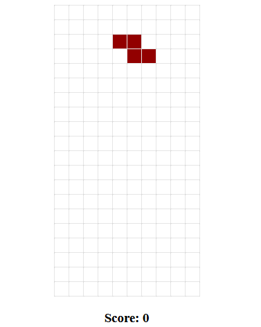

## WASM Tetris
Tetris implemented in rust and exported as wasm! Currently has most of the basic functionality you can expect from Tetris, bugs included!




## Prerequisite
You will need [wasm-pack](https://rustwasm.github.io/wasm-pack/installer/) and [npm](https://www.npmjs.com/get-npm)
Project is built mainly in windows, but it works on linux too!

## How do to build and run 🚀

- clone the repository i.e ssh:
```bash
git clone git@github.com:Avokadoen/tetris_wasm.git
```
- navigate to project root
```bash
cd ./tetris-wasm
```
- run wasm-pack
```bash
wasm-pack build
```
- navigate to ./www from root
```bash
cd ./www
```
- install dependencies through npm
```bash
npm install
```
- run npm to host local server (make sure you are not hosting anything on 8080, or change port)
```bash
npm run start (to change port: -- --port 8008)
```
- go to localhost:8080 in your favourite browser 🎉


## Contributers

Thanks to [leudz](https://github.com/leudz) for fixing my ugly c-style loops and recommending some lint tools. See #17